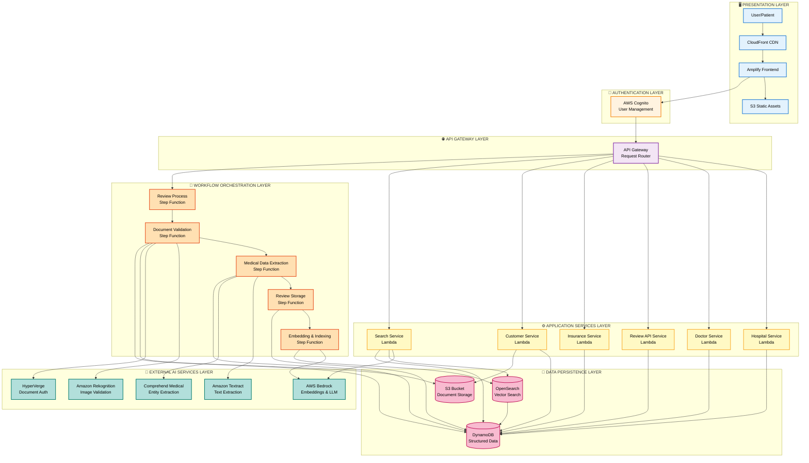
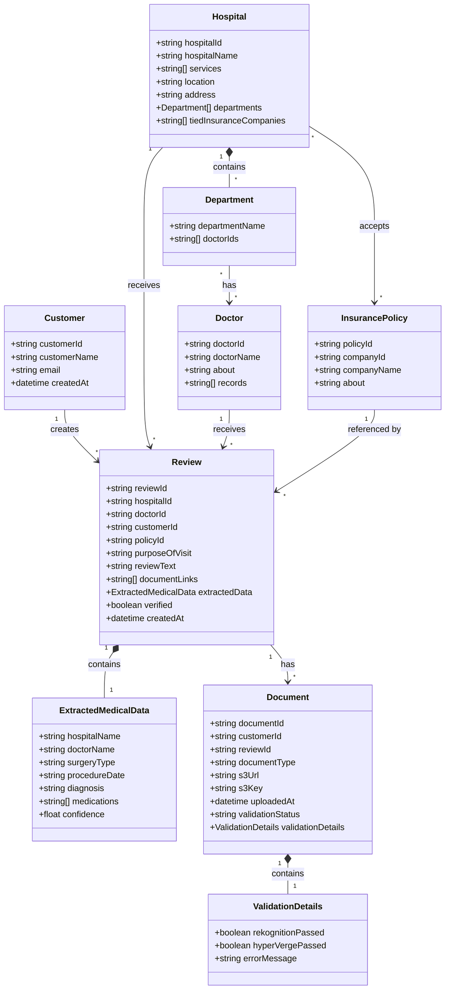

# Design Document: Hospital Review Platform

## Overview

The Hospital Review Platform is a serverless web application built on AWS that improves healthcare transparency for income-constrained individuals. The platform enables patients to submit verified healthcare reviews backed by authentic documents, providing prospective patients with trustworthy information about surgery costs, insurance coverage, doctor qualifications, and hospital quality.

The system uses AI-powered document verification, medical data extraction, and vector search to help users find the best hospitals based on their specific needs, budget, and insurance coverage. By aggregating verified patient experiences, the platform empowers individuals to make financially informed healthcare decisions.

The platform follows a microservices architecture with:
- **Frontend**: React/Amplify application served via CloudFront
- **Authentication**: AWS Cognito for user management
- **API Layer**: API Gateway routing to Lambda microservices
- **Orchestration**: Step Functions for complex workflows
- **AI Services**: Rekognition, HyperVerge, Textract, Comprehend Medical, and Bedrock
- **Storage**: DynamoDB for structured data, S3 for documents, OpenSearch for vector search

## Architecture

### System Architecture Flow

The following N-Tier architecture diagram illustrates the system layers from UI to database:



### Key Architectural Decisions

1. **Microservices Pattern**: Each entity (Hospital, Doctor, Review, Insurance, Customer) has its own Lambda service for CRUD operations, enabling independent scaling and deployment.

2. **Step Functions for Orchestration**: Complex workflows like review submission are orchestrated using Step Functions to manage state, error handling, and retry logic across multiple AI services.

3. **Vector Search with OpenSearch**: Reviews are indexed as vector embeddings in OpenSearch, enabling semantic search capabilities powered by AWS Bedrock.

4. **Document Verification Pipeline**: Multi-stage verification using Rekognition (image manipulation detection) and HyperVerge (authenticity verification) before document storage.

5. **AI-Powered Data Extraction**: Textract extracts text from documents, Comprehend Medical identifies medical entities, reducing manual data entry.

## Components and Interfaces

### Frontend Components

#### CloudFront + Amplify
- **Purpose**: Serve the React frontend application globally with low latency
- **Responsibilities**:
  - Distribute static assets (HTML, CSS, JS) from S3
  - Cache content at edge locations
  - Integrate with Cognito for authentication
- **Interface**: HTTPS endpoints for web access

### Authentication Layer

#### AWS Cognito
- **Purpose**: Manage user authentication and authorization
- **Responsibilities**:
  - User registration and login
  - Issue JWT tokens for API access
  - Manage user sessions
  - Enforce role-based access control (patient vs admin)
- **Interface**: 
  - Input: User credentials
  - Output: JWT tokens with user claims

### API Layer

#### API Gateway
- **Purpose**: Route HTTP requests to appropriate backend services
- **Responsibilities**:
  - Request validation and transformation
  - Authentication token verification
  - Rate limiting and throttling
  - CORS handling
- **Endpoints**:
  - `POST /process` → Review Process Step Function
  - `GET/POST /hospitals` → Hospital Service
  - `GET/POST /doctors` → Doctor Service
  - `GET /reviews` → Review API Service
  - `GET/POST /insurance` → Insurance Service
  - `POST /customers` → Customer Service
  - `POST /search` → Search Lambda

### Lambda Microservices

#### Hospital Service
- **Purpose**: Manage hospital CRUD operations
- **Responsibilities**:
  - Create, read, update hospital records
  - Manage hospital-department relationships
  - Manage hospital-insurance relationships
- **Interface**:
  - Input: Hospital data (hospitalId, name, services, location, address, departments[], tiedInsuranceCompanies[])
  - Output: Hospital records from DynamoDB

#### Doctor Service
- **Purpose**: Manage doctor CRUD operations
- **Responsibilities**:
  - Create, read, update doctor records
  - Link doctor certification documents from S3
  - Associate doctors with hospital departments
- **Interface**:
  - Input: Doctor data (doctorId, name, about, records[])
  - Output: Doctor records from DynamoDB

#### Review API Service
- **Purpose**: Query and retrieve review data
- **Responsibilities**:
  - Retrieve reviews by hospital, doctor, or customer
  - Calculate aggregated statistics (ratings, counts)
  - Return review data with document links
- **Interface**:
  - Input: Query parameters (hospitalId, doctorId, customerId)
  - Output: Review records with S3 document links

#### Insurance Service
- **Purpose**: Manage insurance policy CRUD operations
- **Responsibilities**:
  - Create, read, update insurance policy records
  - Link policies to hospitals that accept them
- **Interface**:
  - Input: Policy data (policyId, companyId, companyName, about)
  - Output: Insurance policy records from DynamoDB

#### Customer Service
- **Purpose**: Manage customer data and document uploads
- **Responsibilities**:
  - Store customer information
  - Handle document uploads to S3
  - Generate presigned URLs for document access
- **Interface**:
  - Input: Customer data, document files
  - Output: Customer records, S3 URLs

#### Search Lambda
- **Purpose**: Orchestrate semantic search across reviews
- **Responsibilities**:
  - Enhance user queries using Bedrock
  - Perform vector search in OpenSearch
  - Generate markdown summaries of results
  - Fetch hospital details for matching reviews
- **Interface**:
  - Input: Search query string, filters (location, insurance, budget)
  - Output: Hospital list with relevance scores, markdown summary
- **Flow**:
  1. Receive search query
  2. Call Bedrock to enhance/optimize query
  3. Perform vector search in OpenSearch
  4. Receive matching review IDs and scores
  5. Call Bedrock to analyze and summarize results
  6. Extract unique hospital IDs
  7. Call Hospital Service to fetch hospital details
  8. Return results with markdown summary

### Step Function Workflows

#### Review Process Step Function
- **Purpose**: Orchestrate the complete review submission workflow
- **Responsibilities**:
  - Coordinate document validation, data extraction, review storage, and indexing
  - Handle errors and retries at each step
  - Maintain workflow state
- **State Machine**:
  ```
  Start → Document Validation → Medical Data Extraction → Review Service → Embedding & Indexing → End
  ```
- **Interface**:
  - Input: Review submission data (documents, text, metadata)
  - Output: Review ID, processing status

#### Document Validation Service (Step Function State)
- **Purpose**: Verify document authenticity
- **Responsibilities**:
  - Validate document format (PDF, JPEG, PNG)
  - Detect image manipulation using Rekognition
  - Verify authenticity using HyperVerge
  - Store verified documents in S3
  - Save document metadata and S3 URLs to DynamoDB
- **Interface**:
  - Input: Document file, document type
  - Output: S3 URL, validation status, metadata
- **Error Handling**: Reject documents that fail validation, return specific error codes

#### Medical Data Extraction Service (Step Function State)
- **Purpose**: Extract medical information from verified documents
- **Responsibilities**:
  - Extract text using Textract
  - Identify medical entities using Comprehend Medical (hospital name, doctor name, surgery type, dates)
  - Present extracted data to user for review/correction
  - Store validated extracted data in DynamoDB
- **Interface**:
  - Input: S3 document URLs
  - Output: Extracted medical entities (hospitalName, doctorName, surgeryType, dates, etc.)
- **Extracted Data Structure**:
  ```json
  {
    "hospitalName": "string",
    "doctorName": "string",
    "surgeryType": "string",
    "procedureDate": "ISO date",
    "diagnosis": "string",
    "medications": ["string"],
    "confidence": "float"
  }
  ```

#### Review Service (Step Function State)
- **Purpose**: Store the review with all associated data
- **Responsibilities**:
  - Validate foreign key relationships (hospitalId, doctorId, policyId exist)
  - Generate unique reviewId
  - Store review with markdown text, document links, extracted data
  - Mark review as verified
  - Link review to hospital and doctor via GSIs
- **Interface**:
  - Input: Review text, hospitalId, doctorId, customerId, policyId (optional), purposeOfVisit, documentLinks[], extractedData
  - Output: reviewId, storage confirmation

#### Embedding & Indexing Service (Step Function State)
- **Purpose**: Generate embeddings and index review for search
- **Responsibilities**:
  - Generate vector embeddings using Bedrock
  - Index embeddings in OpenSearch
  - Index associated metadata (hospital, doctor, surgery type)
  - Mark review as fully processed
- **Interface**:
  - Input: reviewId, review text, metadata
  - Output: Indexing confirmation
- **OpenSearch Index Structure**:
  ```json
  {
    "reviewId": "string",
    "embedding": [float array],
    "hospitalId": "string",
    "hospitalName": "string",
    "doctorId": "string",
    "doctorName": "string",
    "surgeryType": "string",
    "purposeOfVisit": "string",
    "verified": boolean,
    "createdAt": "ISO date"
  }
  ```

### AI Services Integration

#### Amazon Rekognition
- **Purpose**: Detect image manipulation and deepfakes
- **Usage**: Called by Document Validation Service
- **API**: `DetectModerationLabels`, `DetectFaces` for authenticity checks

#### HyperVerge
- **Purpose**: Verify document authenticity (external service)
- **Usage**: Called by Document Validation Service
- **API**: Document verification endpoint

#### Amazon Textract
- **Purpose**: Extract text and structured data from documents
- **Usage**: Called by Medical Data Extraction Service
- **API**: `AnalyzeDocument` with FORMS and TABLES features

#### Amazon Comprehend Medical
- **Purpose**: Extract medical entities from text
- **Usage**: Called by Medical Data Extraction Service
- **API**: `DetectEntitiesV2` to identify medical conditions, procedures, medications, anatomy

#### AWS Bedrock
- **Purpose**: Generate embeddings and enhance search
- **Usage**: 
  - Called by Embedding & Indexing Service to generate embeddings
  - Called by Search Lambda to enhance queries and summarize results
- **Models**: 
  - Embedding model (e.g., Titan Embeddings)
  - LLM for query enhancement and summarization (e.g., Claude)

### Data Storage

#### Amazon DynamoDB

**Purpose**: Store all structured data using NoSQL data model

**Single Table Design**: The system uses a single DynamoDB table with the following access patterns:

**Table Structure**:
- **Partition Key (PK)**: Entity type and ID (e.g., `HOSPITAL#123`, `REVIEW#456`)
- **Sort Key (SK)**: Metadata or relationship identifier (e.g., `METADATA`, `REVIEW#456`)
- **GSI1**: For querying reviews by hospital
  - GSI1PK: `HOSPITAL#{hospitalId}`
  - GSI1SK: `REVIEW#{reviewId}`
- **GSI2**: For querying reviews by doctor
  - GSI2PK: `DOCTOR#{doctorId}`
  - GSI2SK: `REVIEW#{reviewId}`
- **GSI3**: For querying reviews by customer
  - GSI3PK: `CUSTOMER#{customerId}`
  - GSI3SK: `REVIEW#{reviewId}`

**Item Patterns**:

1. **Hospital Item**:
   ```json
   {
     "PK": "HOSPITAL#uuid",
     "SK": "METADATA",
     "entityType": "Hospital",
     "hospitalId": "uuid",
     "hospitalName": "string",
     "services": ["string"],
     "location": "string",
     "address": "string",
     "departments": [
       {
         "departmentName": "string",
         "doctorIds": ["DOCTOR#uuid"]
       }
     ],
     "tiedInsuranceCompanies": ["INSURANCE#uuid"]
   }
   ```

2. **Doctor Item**:
   ```json
   {
     "PK": "DOCTOR#uuid",
     "SK": "METADATA",
     "entityType": "Doctor",
     "doctorId": "uuid",
     "doctorName": "string",
     "about": "string",
     "records": ["s3://bucket/path"]
   }
   ```

3. **Review Item**:
   ```json
   {
     "PK": "REVIEW#uuid",
     "SK": "METADATA",
     "GSI1PK": "HOSPITAL#uuid",
     "GSI1SK": "REVIEW#uuid",
     "GSI2PK": "DOCTOR#uuid",
     "GSI2SK": "REVIEW#uuid",
     "GSI3PK": "CUSTOMER#uuid",
     "GSI3SK": "REVIEW#uuid",
     "entityType": "Review",
     "reviewId": "uuid",
     "hospitalId": "uuid",
     "doctorId": "uuid",
     "customerId": "uuid",
     "policyId": "uuid",
     "purposeOfVisit": "string",
     "reviewText": "markdown string",
     "documentLinks": ["s3://bucket/path"],
     "extractedData": {
       "hospitalName": "string",
       "doctorName": "string",
       "surgeryType": "string",
       "procedureDate": "ISO date",
       "diagnosis": "string",
       "medications": ["string"],
       "confidence": 0.95
     },
     "verified": true,
     "createdAt": "ISO date"
   }
   ```

4. **Insurance Policy Item**:
   ```json
   {
     "PK": "INSURANCE#uuid",
     "SK": "METADATA",
     "entityType": "InsurancePolicy",
     "policyId": "uuid",
     "companyId": "string",
     "companyName": "string",
     "about": "string"
   }
   ```

5. **Customer Item**:
   ```json
   {
     "PK": "CUSTOMER#uuid",
     "SK": "METADATA",
     "entityType": "Customer",
     "customerId": "uuid",
     "customerName": "string",
     "email": "string",
     "createdAt": "ISO date"
   }
   ```

6. **Document Metadata Item**:
   ```json
   {
     "PK": "DOCUMENT#uuid",
     "SK": "METADATA",
     "entityType": "Document",
     "documentId": "uuid",
     "customerId": "uuid",
     "reviewId": "uuid",
     "documentType": "receipt|insurance_email|discharge_summary|other",
     "s3Url": "s3://bucket/path",
     "s3Key": "path/to/document",
     "uploadedAt": "ISO date",
     "validationStatus": "pending|verified|rejected",
     "validationDetails": {
       "rekognitionPassed": true,
       "hyperVergePassed": true,
       "errorMessage": null
     }
   }
   ```

**Access Patterns**:
- Get hospital by hospitalId: Query PK=`HOSPITAL#{id}`, SK=`METADATA`
- Get doctor by doctorId: Query PK=`DOCTOR#{id}`, SK=`METADATA`
- Get review by reviewId: Query PK=`REVIEW#{id}`, SK=`METADATA`
- Get all reviews for hospital: Query GSI1 where GSI1PK=`HOSPITAL#{id}`
- Get all reviews for doctor: Query GSI2 where GSI2PK=`DOCTOR#{id}`
- Get all reviews by customer: Query GSI3 where GSI3PK=`CUSTOMER#{id}`
- Get insurance policy by policyId: Query PK=`INSURANCE#{id}`, SK=`METADATA`
- Get customer by customerId: Query PK=`CUSTOMER#{id}`, SK=`METADATA`
- Get document by documentId: Query PK=`DOCUMENT#{id}`, SK=`METADATA`

#### Amazon S3
- **Purpose**: Store document files
- **Bucket Structure**:
  ```
  /documents/{customerId}/{reviewId}/{documentId}.{ext}
  ```
- **Security**: 
  - Encryption at rest (AES-256)
  - Presigned URLs for time-limited access
  - Bucket policies restricting access to Lambda roles

#### Amazon OpenSearch
- **Purpose**: Vector database for semantic search
- **Index**: `reviews-index`
- **Query Types**:
  - k-NN vector search for semantic similarity
  - Filtered search by hospital, doctor, surgery type
  - Hybrid search combining vector and keyword matching

## Data Models

### Entity Class Diagram

The following diagram illustrates the core entities and their relationships:



### Relationship Descriptions

1. **Customer → Review**: One-to-many. A customer can create multiple reviews.

2. **Hospital → Review**: One-to-many. A hospital can receive multiple reviews.

3. **Doctor → Review**: One-to-many. A doctor can receive multiple reviews.

4. **Insurance Policy → Review**: One-to-many (optional). A review may reference an insurance policy if the patient used insurance.

5. **Hospital → Department**: One-to-many (composition). A hospital contains multiple departments as embedded objects.

6. **Department → Doctor**: Many-to-many. A department references multiple doctors via doctorIds array, and a doctor can be in multiple departments.

7. **Hospital ↔ Insurance Policy**: Many-to-many. A hospital accepts multiple insurance policies (via tiedInsuranceCompanies array), and a policy can be accepted by multiple hospitals.

8. **Review → Document**: One-to-many. A review has multiple supporting documents (receipts, insurance emails, discharge summaries).

9. **Review → ExtractedMedicalData**: One-to-one (composition). Each review contains extracted medical data as an embedded object.

10. **Document → ValidationDetails**: One-to-one (composition). Each document contains validation details as an embedded object.

### Hospital
```typescript
interface Hospital {
  hospitalId: string;           // UUID
  hospitalName: string;
  services: string[];           // e.g., ["Cardiology", "Neurology"]
  location: string;             // City/region
  address: string;
  departments: Department[];
  tiedInsuranceCompanies: string[]; // Array of policyIds
}

interface Department {
  departmentName: string;
  doctorIds: string[];          // Array of doctorIds in this department
}
```

### Doctor
```typescript
interface Doctor {
  doctorId: string;             // UUID
  doctorName: string;
  about: string;                // Biography/description
  records: string[];            // Array of S3 URLs for certifications, education, etc.
}
```

### Insurance Policy
```typescript
interface InsurancePolicy {
  policyId: string;             // UUID (same as insuranceId)
  companyId: string;
  companyName: string;
  about: string;                // Policy description
}
```

### Customer
```typescript
interface Customer {
  customerId: string;           // UUID
  customerName: string;
  email: string;
  createdAt: string;            // ISO date
}
```

### Review
```typescript
interface Review {
  reviewId: string;             // UUID
  hospitalId: string;           // Foreign key to Hospital
  doctorId: string;             // Foreign key to Doctor
  customerId: string;           // Foreign key to Customer
  policyId?: string;            // Optional foreign key to InsurancePolicy
  purposeOfVisit: string;       // e.g., "Heart Surgery", "Routine Checkup"
  reviewText: string;           // Markdown-formatted review
  documentLinks: string[];      // Array of S3 URLs
  extractedData: ExtractedMedicalData;
  verified: boolean;            // True if documents passed validation
  createdAt: string;            // ISO date
}

interface ExtractedMedicalData {
  hospitalName: string;
  doctorName: string;
  surgeryType: string;
  procedureDate: string;
  diagnosis: string;
  medications: string[];
  confidence: number;           // 0-1 confidence score from AI extraction
}
```

### Search Result
```typescript
interface SearchResult {
  hospitals: HospitalSummary[];
  markdownSummary: string;      // Generated by Bedrock
  totalResults: number;
}

interface HospitalSummary {
  hospitalId: string;
  hospitalName: string;
  location: string;
  services: string[];
  reviewCount: number;
  averageRating: number;
  relevanceScore: number;       // From vector search
}
```

### Document Metadata
```typescript
interface DocumentMetadata {
  documentId: string;           // UUID
  customerId: string;
  reviewId: string;
  documentType: 'receipt' | 'insurance_email' | 'discharge_summary' | 'other';
  s3Url: string;
  s3Key: string;
  uploadedAt: string;           // ISO date
  validationStatus: 'pending' | 'verified' | 'rejected';
  validationDetails: {
    rekognitionPassed: boolean;
    hyperVergePassed: boolean;
    errorMessage?: string;
  };
}
```


## Correctness Properties

A property is a characteristic or behavior that should hold true across all valid executions of a system—essentially, a formal statement about what the system should do. Properties serve as the bridge between human-readable specifications and machine-verifiable correctness guarantees.

### Property 1: Authentication Token Validity
*For any* successful authentication, the system should issue a valid JWT token that can be verified by the API Gateway.
**Validates: Requirements 1.2, 1.3**

### Property 2: Access Control Enforcement
*For any* patient and any review, the patient should only be able to access and modify reviews where customerId matches their authenticated user ID.
**Validates: Requirements 1.4, 11.3**

### Property 3: Role-Based Authorization
*For any* administrative function request, the system should only allow access if the authenticated user has an admin role.
**Validates: Requirements 1.5**

### Property 4: Document Format Validation
*For any* uploaded file, the system should accept it if and only if the file format is PDF, JPEG, or PNG.
**Validates: Requirements 2.1**

### Property 5: Document Rejection on Validation Failure
*For any* document that fails authenticity verification (Rekognition or HyperVerge), the system should reject it and return a specific error message.
**Validates: Requirements 2.5**

### Property 6: Verified Document Storage with Unique Keys
*For any* document that passes authenticity verification, the system should store it in S3 with a unique key and generate a unique S3 URL.
**Validates: Requirements 2.6, 2.7**

### Property 7: Document URL Persistence
*For any* verified document, the system should save its S3 URL (not the document itself) in the review collection in DynamoDB.
**Validates: Requirements 2.8, 2.9**

### Property 8: Extracted Data Modification
*For any* extracted medical data presented to a patient, the system should accept and store the patient's modifications.
**Validates: Requirements 3.5, 3.6**

### Property 9: Extracted Data Pre-fills Form Fields
*For any* confirmed extracted medical data, the system should use it to pre-fill hospitalId, doctorId, and purposeOfVisit fields in the review form.
**Validates: Requirements 3.7**

### Property 10: Markdown Text Acceptance
*For any* review submission with markdown-formatted text, the system should accept and store the markdown correctly.
**Validates: Requirements 4.1**

### Property 11: Required Document Validation
*For any* review submission without supporting documents, the system should reject it.
**Validates: Requirements 4.2**

### Property 12: Required Field Validation
*For any* review submission, the system should reject it if hospitalId, doctorId, or purposeOfVisit is missing.
**Validates: Requirements 4.3**

### Property 13: Conditional Insurance Field Validation
*For any* review submission that indicates insurance usage, the system should reject it if policyId is missing.
**Validates: Requirements 4.4**

### Property 14: Verified Review Marking
*For any* review submitted with all documents passing verification, the system should mark the review as verified (verified=true).
**Validates: Requirements 4.5**

### Property 15: Unique Review ID Generation
*For any* stored review, the system should assign it a unique reviewId that doesn't conflict with existing reviews.
**Validates: Requirements 4.6, 10.3**

### Property 16: Document URL Linking
*For any* stored review, the system should link all associated document S3 URLs to the review.
**Validates: Requirements 4.7**

### Property 17: Embedding Storage in OpenSearch
*For any* generated vector embedding, the system should store it in the OpenSearch index.
**Validates: Requirements 5.2**

### Property 18: Indexed Metadata Completeness
*For any* indexed review, the OpenSearch document should contain hospital information, doctor information, and medical data fields.
**Validates: Requirements 5.4**

### Property 19: Review Processing Status
*For any* review that completes indexing, the system should mark it as fully processed.
**Validates: Requirements 5.5**

### Property 20: Hospital Data Model Completeness
*For any* hospital record, it should contain hospitalId, hospitalName, services, location, address, departments, and tiedInsuranceCompanies fields.
**Validates: Requirements 6.2**

### Property 21: Doctor Data Model Completeness
*For any* doctor record, it should contain doctorId, doctorName, about, and records fields.
**Validates: Requirements 6.4**

### Property 22: Doctor Certification Linking
*For any* uploaded doctor certification document, the system should store it in S3 and add its URL to the doctor's records array.
**Validates: Requirements 6.5**

### Property 23: Department-Doctor Association
*For any* hospital department, the department's doctorIds array should only contain valid doctor IDs that exist in the database.
**Validates: Requirements 6.6**

### Property 24: Hospital-Insurance Relationship Maintenance
*For any* hospital, the tiedInsuranceCompanies array should only contain valid policyIds that exist in the database.
**Validates: Requirements 6.7, 7.3**

### Property 25: Insurance Data Model Completeness
*For any* insurance policy record, it should contain policyId, companyId, companyName, and about fields.
**Validates: Requirements 7.2**

### Property 26: Review-Insurance Linking
*For any* review that includes insurance claim information, the review should have a valid policyId that references an existing insurance policy.
**Validates: Requirements 7.4**

### Property 27: Search Result Uniqueness
*For any* search query, the system should extract unique hospital IDs from matching reviews (no duplicates).
**Validates: Requirements 8.5**

### Property 28: Hospital Detail Retrieval
*For any* list of hospital IDs, the system should fetch complete hospital details for all IDs.
**Validates: Requirements 8.6**

### Property 29: Search Response Completeness
*For any* search query, the response should contain hospital summaries and a markdown analysis.
**Validates: Requirements 8.7**

### Property 30: Hospital Detail Page Completeness
*For any* selected hospital, the system should retrieve and return all associated reviews, doctors, and accepted insurance policies.
**Validates: Requirements 8.8, 8.9, 8.10, 8.11**

### Property 31: Review Retrieval by Entity
*For any* hospital or doctor ID, the system should retrieve all reviews associated with that entity.
**Validates: Requirements 9.1**

### Property 32: Aggregated Statistics Calculation
*For any* set of reviews, the system should correctly calculate average ratings and review counts.
**Validates: Requirements 9.2**

### Property 33: Review Response Document Links
*For any* review response, it should include all associated document S3 URLs.
**Validates: Requirements 9.4**

### Property 34: Review Verification Status Display
*For any* review response, it should include the verification status (verified boolean).
**Validates: Requirements 9.5**

### Property 35: Foreign Key Referential Integrity
*For any* review submission, the system should reject it if hospitalId, doctorId, policyId (if provided), or customerId doesn't reference an existing record.
**Validates: Requirements 10.1**

### Property 36: Document Validation Prerequisite
*For any* review, the system should prevent completion until all referenced documents have passed validation.
**Validates: Requirements 10.2**

### Property 37: Document URL Validity
*For any* review that references a document, the S3 URL should be accessible and point to a valid document.
**Validates: Requirements 10.4**

### Property 38: Presigned URL Expiration
*For any* generated presigned URL for document access, it should have an expiration time set.
**Validates: Requirements 11.5**

### Property 39: API Routing Correctness
*For any* API request to a specific path (/hospitals, /doctors, /reviews, /insurance, /customers, /search, /process), the API Gateway should route it to the correct service.
**Validates: Requirements 13.2, 13.3, 13.4, 13.5, 13.6, 13.7, 13.8**

### Property 40: Error Response Format
*For any* API operation that fails, the system should return an appropriate HTTP status code and error message.
**Validates: Requirements 13.9**

### Property 41: Rate Limiting Enforcement
*For any* client making excessive requests, the API Gateway should throttle requests after exceeding the rate limit.
**Validates: Requirements 13.10**

## Error Handling

### Document Validation Errors
- **Invalid Format**: Return 400 Bad Request with message "Unsupported file format. Please upload PDF, JPEG, or PNG."
- **Rekognition Failure**: Return 422 Unprocessable Entity with message "Document failed authenticity check: image manipulation detected."
- **HyperVerge Failure**: Return 422 Unprocessable Entity with message "Document failed authenticity verification."
- **S3 Upload Failure**: Return 500 Internal Server Error with message "Failed to store document. Please try again."

### Data Extraction Errors
- **Textract Failure**: Return 500 Internal Server Error with message "Failed to extract text from document."
- **Comprehend Medical Failure**: Log warning, continue with manual entry, return 200 with empty extractedData
- **Low Confidence Extraction**: Return 200 with extractedData and confidence score, prompt user to verify

### Review Submission Errors
- **Missing Required Fields**: Return 400 Bad Request with message "Missing required fields: [field names]"
- **Invalid Foreign Keys**: Return 400 Bad Request with message "Invalid reference: [entity] with ID [id] does not exist"
- **Unverified Documents**: Return 400 Bad Request with message "Cannot submit review: documents pending verification"
- **Missing Insurance Policy**: Return 400 Bad Request with message "Insurance policy ID required when insurance claim information is provided"

### Search Errors
- **Bedrock Timeout**: Return 504 Gateway Timeout with message "Search service temporarily unavailable"
- **OpenSearch Failure**: Return 500 Internal Server Error with message "Search index unavailable"
- **No Results**: Return 200 with empty results array and message "No hospitals found matching your criteria"

### Authentication/Authorization Errors
- **Invalid Token**: Return 401 Unauthorized with message "Invalid or expired authentication token"
- **Insufficient Permissions**: Return 403 Forbidden with message "You do not have permission to access this resource"
- **Access Denied**: Return 403 Forbidden with message "You can only access your own reviews"

### Rate Limiting Errors
- **Too Many Requests**: Return 429 Too Many Requests with message "Rate limit exceeded. Please try again later." and Retry-After header

### Step Function Errors
- **Workflow Timeout**: Retry with exponential backoff, max 3 attempts
- **Service Unavailable**: Retry with exponential backoff, max 3 attempts
- **Validation Failure**: Do not retry, return error to user
- **Data Integrity Error**: Do not retry, rollback changes, return error to user

## Testing Strategy

### Dual Testing Approach

The system will use both unit tests and property-based tests for comprehensive coverage:

**Unit Tests** focus on:
- Specific examples of document validation (valid PDF, invalid format)
- Edge cases (empty review text, missing fields)
- Error conditions (network failures, service timeouts)
- Integration points between services
- Step Function state transitions

**Property-Based Tests** focus on:
- Universal properties that hold for all inputs
- Comprehensive input coverage through randomization
- Data integrity across operations
- Access control enforcement
- Referential integrity

### Property-Based Testing Configuration

**Testing Library**: 
- For TypeScript/JavaScript: `fast-check`
- For Python: `hypothesis`

**Test Configuration**:
- Minimum 100 iterations per property test
- Each property test must reference its design document property
- Tag format: `Feature: hospital-review-platform, Property {number}: {property_text}`

**Example Property Test Structure**:
```typescript
// Feature: hospital-review-platform, Property 2: Access Control Enforcement
test('patients can only access their own reviews', async () => {
  await fc.assert(
    fc.asyncProperty(
      fc.uuid(), // patientId
      fc.uuid(), // reviewId
      fc.uuid(), // otherPatientId
      async (patientId, reviewId, otherPatientId) => {
        // Create review owned by patientId
        await createReview({ reviewId, customerId: patientId });
        
        // Attempt access by otherPatientId should fail
        const result = await accessReview(reviewId, otherPatientId);
        expect(result.status).toBe(403);
        
        // Attempt access by patientId should succeed
        const result2 = await accessReview(reviewId, patientId);
        expect(result2.status).toBe(200);
      }
    ),
    { numRuns: 100 }
  );
});
```

### Test Coverage Goals

- **Unit Test Coverage**: 80% code coverage minimum
- **Property Test Coverage**: All 41 correctness properties implemented
- **Integration Test Coverage**: All service-to-service interactions
- **End-to-End Test Coverage**: Critical user flows (review submission, search)

### Testing Environments

- **Local**: DynamoDB Local, LocalStack for S3, mocked AI services
- **CI/CD**: AWS SAM Local, integration tests against test AWS account
- **Staging**: Full AWS environment with test data
- **Production**: Synthetic monitoring, canary deployments

### Key Test Scenarios

1. **Review Submission Flow**:
   - Upload documents → Validation → Extraction → Review submission → Indexing
   - Test with various document types, sizes, and content
   - Test with valid and invalid medical data
   - Test with and without insurance information

2. **Search Flow**:
   - Query enhancement → Vector search → Result aggregation → Hospital details
   - Test with various query types (surgery type, location, insurance)
   - Test with no results, single result, multiple results
   - Test hospital detail retrieval with all associated data

3. **Access Control**:
   - Test patient access to own vs others' reviews
   - Test admin access to all resources
   - Test unauthenticated access rejection
   - Test token expiration handling

4. **Data Integrity**:
   - Test foreign key validation
   - Test unique ID generation
   - Test referential integrity on deletes
   - Test document URL validity

5. **Error Handling**:
   - Test all error scenarios in Error Handling section
   - Test retry logic in Step Functions
   - Test graceful degradation when AI services fail
   - Test rate limiting enforcement
